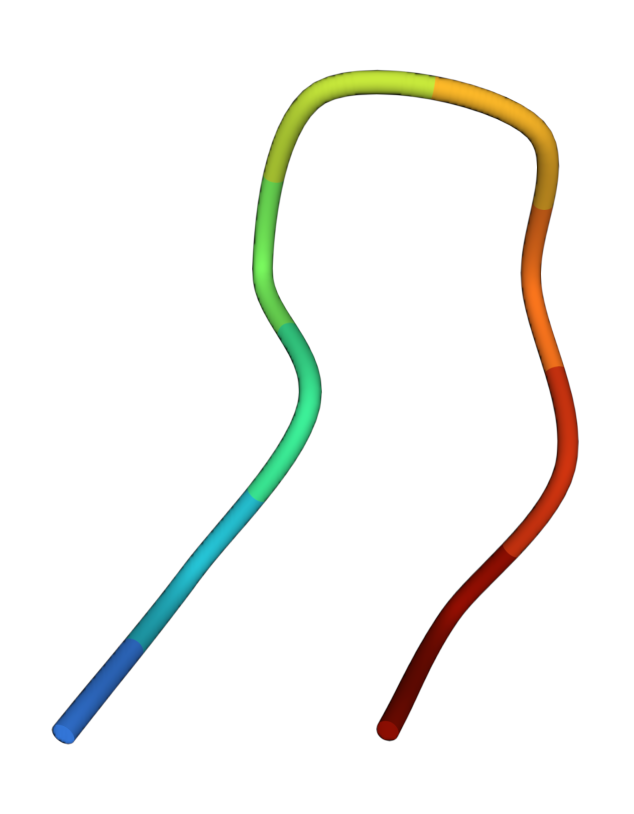
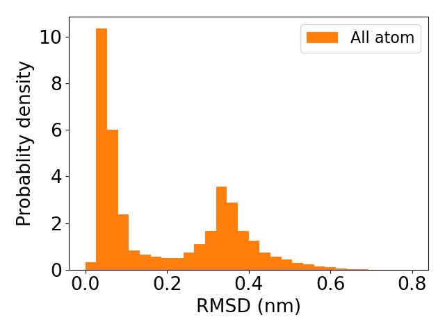

.. _chignolin:

Fold the mini-protein, chignolin
=================================

	   
Chignolin is an artificial mini-protein consisting of only 10 amino acid residues.
Here we use potential contrasting to learn a coarse-grained force field that can
capture the protein's folding and unfolding 

1. Download the all-atom simulation trajectory
----------------------------------------------

An all-atom simulation of chignolin is used as training data.
You can follow the link `pccg-chignolin <https://www.kaggle.com/datasets/negelis/pccg-chignolin>`_
to download the all-atom simulation trajectory.
Then you should uncompress the downloaded data and move them to the directory ``WORK_DIR/data``.
Here ``WORK_DIR`` can be any directory and wil be used as the working directory for running commands
in the tutorial.
In other words, you should change your working directory to ``WORK_DIR`` before running following commands.
In the direcotry ``WORK_DIR/data``, there should be three files:

* ``cln025_all_atom.dcd``: an all-atom simulation trajectory
* ``cln025.prmtop``: the topology file of chignolin
* ``cln025_reference.pdb``: a folded conformation of chignolin

The all-atom simulation was conducted with implicit solvent and near the folding temperature,
so the all-atom simulation trajectory contains both folded and unfolded conformations.
You can visualize the trajectory by loading it together with the topology file into softwares such as ``VMD``.

2. Convert the all-atom trajectory into a coarse-grained one
------------------------------------------------------------

First we need to choose a coarse-grained representation for the force field.
Here we choose to represent each amino acid residue with just one particle
fixed at the residue's :math:`\alpha` carbon atom postion.
With this coarse-grained representation, let us convert the all-atom trajectory
into a coarse-grained one, which will be used as training data.

.. code-block:: python

   import numpy as np
   import matplotlib as mpl
   import matplotlib.pyplot as plt
   import mdtraj
   import os
   import scipy
   import scipy.optimize as optimize
   import scipy.cluster.hierarchy
   from scipy.spatial.distance import squareform
   import torch
   import math
   import openmm
   import openmm.unit as unit
   import openmm.app as ommapp
   import time
   from sys import exit
   
   #### convert the all atom trajectory into a coarse-grained one
   top_aa = mdtraj.load_prmtop('./data/cln025_all_atom.prmtop')
   traj_aa = mdtraj.load_dcd('./data/cln025_all_atom.dcd', top_aa, stride = 10)
   
   alpha_carbon_atom_indices = []
   for atom in top_aa.atoms:
       if atom.name == 'CA':
           alpha_carbon_atom_indices.append(atom.index)
   traj_cg = traj_aa.atom_slice(alpha_carbon_atom_indices)
   
   os.makedirs('./output/', exist_ok = True)
   traj_cg.save_dcd('./output/cln025_cg.dcd')

		
We can visualize the coarse-grained trajectory by projecting conformations into
a low dimensional space spanned by collective variables such as the
RMSD (root-mean-squared-distance) with respect to the folded conformations.

.. code-block:: python

   top_cg = mdtraj.load_psf('./data/cln025_cg.psf')
   traj_cg = mdtraj.load_dcd('./output/cln025_cg.dcd', top_cg)
   
   ref_pdb = mdtraj.load_pdb('./data/cln025_reference.pdb')
   ref_pdb = ref_pdb.atom_slice(alpha_carbon_atom_indices)
   ref_traj = mdtraj.Trajectory(ref_pdb.xyz, topology = top_cg)
   rmsd = mdtraj.rmsd(traj_cg, ref_traj)
   
   fig = plt.figure()
   fig.clf()
   plt.hist(rmsd, bins = 30, density = True, range = (0, 0.8), color = 'C1', label = 'All atom')
   plt.legend()
   plt.xlabel('RMSD (nm)')
   plt.ylabel('Probablity density')
   plt.tight_layout()
   plt.savefig('./output/rmsd_hist_all_atom.png')
   plt.close()
   

