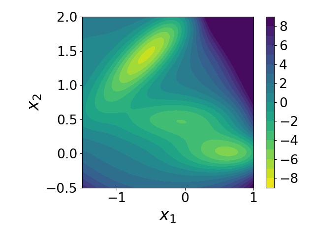
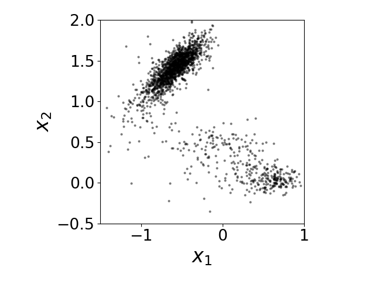
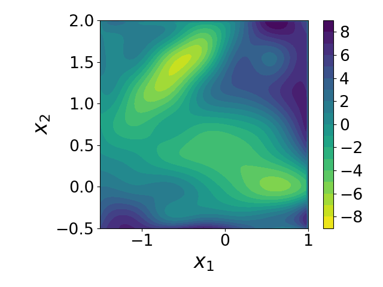

.. _chignolin:

=============================
Folding of the Chignolin protein
=============================

Here we use the Müller potential and samples from it to show how to use potential contrasting to learn a potential energy function that can reproduce a distribution of samples.

1. The Müller potential
-----------------------

The Müller potential is defined as

.. math::

   U(x_1, x_2) = s \cdot \sum_{k = 1}^{4} A_k \cdot \exp\left( \alpha_k (x_1 - a_k)^2 + \beta_k (x_1 - a_k)(x_2 - b_k) + \gamma_k (x_2 - b_k)^2 \right),

where :math:`(A_1, A_2, A_3, A_4) = (-200, -100, -170, 15)`, :math:`(\alpha_1, \alpha_2, \alpha_3, \alpha_4) = (-1, -1, -6.5, 0.7)`, :math:`(\beta_1, \beta_2, \beta_3, \beta_4) = (0, 0, 11, 0.6)`, :math:`(\gamma_1, \gamma_2, \gamma_3, \gamma_4) = (-10, -10, -6.5, 0.7)`, :math:`(a_1, a_2, a_3, a_4) =  (1, 0, -0.5, -1)`, and :math:`(b_1, b_2, b_3, b_4) = (0, 0.5, 1.5, 1)`.
:math:`s` is a scaling parameter and is set to :math:`0.05` in this tutorial.

Now let us define the Müller potential in a ``Python`` function.

.. code-block:: python

   import torch
   
   def compute_Muller_potential(scale, x):
       A = (-200.0, -100.0, -170.0, 15.0)
       beta = (0.0, 0.0, 11.0, 0.6)
       alpha_gamma = (
           x.new_tensor([-1.0, -10.0]),
           x.new_tensor([-1.0, -10.0]),
           x.new_tensor([-6.5, -6.5]),
           x.new_tensor([0.7, 0.7]),
       )
   
       ab = (
           x.new_tensor([1.0, 0.0]),
           x.new_tensor([0.0, 0.5]),
           x.new_tensor([-0.5, 1.5]),
           x.new_tensor([-1.0, 1.0]),
       )
   
       U = 0
       for i in range(4):
           diff = x - ab[i]
           U = U + A[i] * torch.exp(
               torch.sum(alpha_gamma[i] * diff**2, -1) + beta[i] * torch.prod(diff, -1)
           )
   
       U = scale * U
       return U
		
		
Because the potential function is defined over a two dimensional space, we can
visualize it using a two dimensional heatmap.

.. code-block:: python

   import matplotlib.pyplot as plt
   from matplotlib import cm
   import numpy as np
   
   def generate_grid(x1_min, x1_max, x2_min, x2_max, size=100):
       x1 = torch.linspace(x1_min, x1_max, size)
       x2 = torch.linspace(x2_min, x2_max, size)
       grid_x1, grid_x2 = torch.meshgrid(x1, x2, indexing="ij")
       grid = torch.stack([grid_x1, grid_x2], dim=-1)
       x = grid.reshape((-1, 2))
       return x
   
   
   x1_min, x1_max = -1.5, 1.0
   x2_min, x2_max = -0.5, 2.0
   
   grid_size = 100
   x_grid = generate_grid(x1_min, x1_max, x2_min, x2_max, grid_size)
   fig, axes = plt.subplots()
   scale = 0.05
   U = compute_Muller_potential(scale, x_grid)
   U = U.reshape(100, 100)
   U[U > 9] = 9
   U = U.T
   plt.contourf(
       U,
       levels=np.linspace(-9, 9, 19),
       extent=(x1_min, x1_max, x2_min, x2_max),
       cmap=cm.viridis_r,
   )
   plt.xlabel(r"$x_1$", fontsize=24)
   plt.ylabel(r"$x_2$", fontsize=24)
   plt.colorbar()
   axes.set_aspect("equal")
   plt.tight_layout()
   plt.savefig("./data/mp.png")
   plt.close()
   		
The heatmap of the potential looks like the following. It shows that the
potential has three meta-stable states.

The Müller potential defines a Boltzmann distribution:
:math:`p(x_1, x_2) \propto \exp\left( -U(x_1, x_2) \right)`.
Samples from the Boltzmann distribution are stored in the file
``./data/samples.csv`` and can be loaded as the following.

.. code-block:: python

   x_data = np.loadtxt("./data/samples.csv", delimiter=",")
   x_data = torch.from_numpy(x_data)
   n_data = x_data.shape[0]

We can visualize these samples by plotting them the two dimensional space.

.. code-block:: python

   fig = plt.figure()
   fig.clf()
   plt.plot(x_data[::10, 0].numpy(), x_data[::10, 1].numpy(), ".", alpha=0.5)
   plt.xlim((x1_min, x1_max))
   plt.ylim((x2_min, x2_max))
   plt.xlabel(r"$x_1$", fontsize=24)
   plt.ylabel(r"$x_2$", fontsize=24)
   axes.set_aspect("equal")
   plt.tight_layout()
   plt.savefig("./data/mp_samples.png")
   plt.close()
      

   
..
   We can also draw sample from the potential based on its Boltzmann distribution
   :math:`p(x_1, x_2) \propto \exp\left( -U(x_1, x_2) \right)`.
   Here we use a temperature replica exchange Monte Carlo approach to draw samples
   from it.
   .. note::
   
      The main purpose of the following Monte Carlo sampling code is to draw samples
      from the Müller potential so that we can use the samples as training data
      in potential contrasting. You don't have to understand the Monte Carlo sampling
      code for understanding potential contrasting. You can skip it if you find it
      confusing at this point and just keep in mind that running it provides samples
      from the Müller potential and the samples are saved in the numpy array ``x_samples``.
      
   .. code-block:: python
		   
      ## draw samples from the Müller potential using temperature replica exchange
      ## Monte Carlo sampling
      ############################################################################
      
      num_reps = 10 # number of replicas
      scales = torch.linspace(0.0, scale, num_reps)
      
      num_steps = 110000
      x_record = []
      accept_rate = 0
      x = torch.stack((x1_min + torch.rand(num_reps)*(x1_max - x1_min),
                       x2_min + torch.rand(num_reps)*(x2_max - x2_min)),
                      dim = -1)
      energy = compute_Muller_potential(1.0, x)
      
      for k in range(num_steps):
          if (k + 1) % 10000 == 0:
              print("steps: {} out of {} total steps".format(k, num_steps))
              
          ## sampling within each replica
          delta_x = torch.normal(0, 1, size = (num_reps, 2))*0.3
          x_p = x + delta_x
          energy_p = compute_Muller_potential(1.0, x_p)
      
          ## accept based on energy
          accept_prop = torch.exp(-scales*(energy_p - energy))
          accept_flag = torch.rand(num_reps) < accept_prop
      
          ## considering the bounding effects
          accept_flag = accept_flag & torch.all(x_p > x_p.new_tensor([x1_min, x2_min]), -1) \
                                    & torch.all(x_p < x_p.new_tensor([x1_max, x2_max]), -1)
          
          x_p[~accept_flag] = x[~accept_flag]
          energy_p[~accept_flag] = energy[~accept_flag]    
          x = x_p
          energy = energy_p
      
          ## calculate overall accept rate
          accept_rate = accept_rate + (accept_flag.float() - accept_rate)/(k+1)    
          
          ## exchange
          if k % 10 == 0:
              for i in range(1, num_reps):
                  accept_prop = torch.exp((scales[i] - scales[i-1])*(energy[i] - energy[i-1]))
                  accept_flag = torch.rand(1) < accept_prop
                  if accept_flag.item():
                      tmp = x[i].clone()
                      x[i] = x[i-1]
                      x[i-1] = tmp
      
                      tmp = energy[i].clone()
                      energy[i] = energy[i-1]
                      energy[i-1] = tmp
   		   
              if k >= 10000:
                  x_record.append(x.clone().numpy())
   
      x_record = np.array(x_record)
      
      x_samples = x_record[:,-1,:]
      

In the following, we pretend that we don't know the energy function of the Müller potential
and only have the samples from it. We want to use the samples as training
data and use the potential contrasting method to learn a potential energy function that should be close to the
Müller potential energy function.
	   
2. Define a noise distribution and generate noise samples
-----------------------------------------------------------

To use potential contrasting, we need to define a noise distribution and generate noise samples from it.
Because the Müller potential has just two dimensions, we can use as the noise
distribution a uniform distribution over the coordinates' range.
The following code block defines the noise distribution and generates noises
samples.

.. code-block:: python

   import math
   
   def compute_log_q(x, x1_limits = (x1_min, x1_max), x2_limits = (x2_min, x2_max)):
       x1_min, x1_max = x1_limits
       x2_min, x2_max = x2_limits
       log_q = math.log(1/(x1_max - x1_min) * 1/(x2_max - x2_min))
       return torch.ones(x.shape[0])*log_q
   
   n_noise = n_data
   x1_noise = torch.rand(n_noise)*(x1_max - x1_min) + x1_min
   x2_noise = torch.rand(n_noise)*(x2_max - x2_min) + x2_min
   x_noise = torch.stack((x1_noise, x2_noise), dim = 1)

	   
3. Learn an energy function using potential contrasting
--------------------------------------------------------

Now we are ready to learn a potential energy function that can reproduce the data distribution.
First we need to parameterize the function used to represent the potential energy.
Here we use a two-dimensional cubic spline model, i.e.,

.. math::

   U(x_1, x_2; \boldsymbol{\theta}) = \sum_{i=1}^{M_1}\sum_{j=1}^{M_2} \theta_{ij} g_{ij}(x_1, x_2),

where :math:`g_{ij}(x_1, x_2) = h_{1i}(x_1) h_{2j}(x_2), i = 1, ..., M_1, j = 1, ..., M_2`.
:math:`h_{1i}(x_1), i = 1, ..., M_1` are a set of cubic spline basis functions for the coordinate :math:`x_1` and
:math:`h_{2j}(x_2), j = 1, ..., M_2` for the coordinate :math:`x_2`.
:math:`\theta_{ij}, i = 1, ..., M_1, j = 1, ..., M_2` are parameters that will be learned in potential contrasting.
There are many different ways to define basis functions for a cubic spline and we use B-spline basis functions.
We use the following function to compute values of B-spline basis functions for a given set of inputs :math:`x`.

.. code-block:: python

   import PC
   
   def compute_2d_cubic_spline_basis(
       x, M1=10, M2=10, x1_limits=(x1_min, x1_max), x2_limits=(x2_min, x2_max)
   ):
       x1_min, x1_max = x1_limits
       x2_min, x2_max = x2_limits
   
       ## degree of spline
       k = 3
   
       num_knots_x1 = M1 - k - 2
       num_knots_x2 = M2 - k - 2
   
       ## knots of cubic spline
       knots_x1 = torch.linspace(x1_min, x1_max, num_knots_x1 + 2)[1:-1]
       knots_x2 = torch.linspace(x2_min, x2_max, num_knots_x2 + 2)[1:-1]
   
       boundary_knots_x1 = torch.tensor([x1_min, x1_max])
       boundary_knots_x2 = torch.tensor([x2_min, x2_max])
   
       basis_x1 = PC.spline.bs(x[:, 0], knots_x1, boundary_knots_x1)
       basis_x2 = PC.spline.bs(x[:, 1], knots_x2, boundary_knots_x2)
   
       basis = basis_x1[:, :, None] * basis_x2[:, None, :]
       basis = basis.reshape(-1, M1 * M2)
       return basis
   
Once we specify the basis functions :math:`g_{ij}(x_1, x_2)`, learning the
energy function :math:`U(x_1, x_2; \boldsymbol{\theta})` reduces to fitting
the parameters :math:`\boldsymbol{\theta}`. We will use the noise contrastive
estimation (implemented in the function ``PC.NCE``) to do that.

.. code-block:: python
		
   basis_data = compute_2d_cubic_spline_basis(x_data)
   basis_noise = compute_2d_cubic_spline_basis(x_noise)
   log_q_data = compute_log_q(x_data)
   log_q_noise = compute_log_q(x_noise)
   theta, dF = PC.NCE(log_q_noise, log_q_data, basis_noise, basis_data)

After fitting the parameters :math:`\boldsymbol{\theta}`, we can visulize the
learned energy function by computing and plotting its values on aa two-dimensional
grid.
   
.. code-block:: python

   basis_grid = compute_2d_cubic_spline_basis(x_grid)
   U_grid = torch.matmul(basis_grid, theta)
   U_grid = U_grid.reshape((grid_size, grid_size))
   
   U_grid = U_grid - U_grid.min() + U.min()
   U_grid[U_grid > 9] = 9
   fig, axes = plt.subplots()
   plt.contourf(
       U_grid.T.numpy(),
       levels=np.linspace(-9, 9, 19),
       extent=(x1_min, x1_max, x2_min, x2_max),
       cmap=cm.viridis_r,
   )
   plt.xlabel(r"$x_1$", fontsize=24)
   plt.ylabel(r"$x_2$", fontsize=24)
   plt.colorbar()
   axes.set_aspect("equal")
   plt.tight_layout()
   plt.savefig("./data/learned_potential.png")
   plt.close()
   		

We see that the learned potential energy function matches the Müller potential well.
