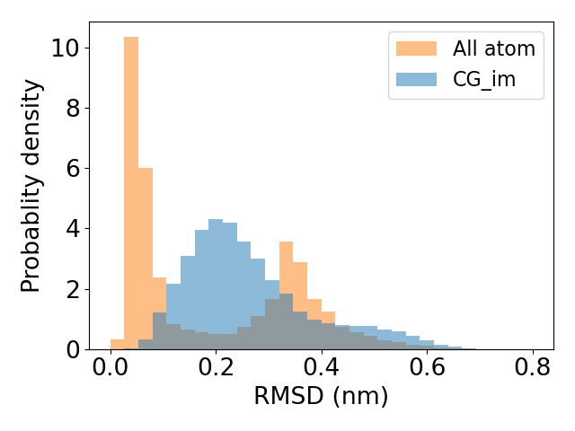

.. _chignolin:

Fold the mini-protein, chignolin
=================================

.. image:: ../../examples/chignolin/data/2RVD.png
  :width: 200
  :alt: folded structure of the chignolin protein	  
	   
Chignolin is an artificial mini-protein consisting of only 10 amino acid residues.
Here we use potential contrasting to learn a coarse-grained force field that can
capture the protein's folding and unfolding 

1. Download the all-atom simulation trajectory
----------------------------------------------

An all-atom simulation of chignolin is used as training data.
You can follow the link `pccg-chignolin <https://www.kaggle.com/datasets/negelis/pccg-chignolin>`_
to download the all-atom simulation trajectory.
Then you should uncompress the downloaded data and move them to the directory ``WORK_DIR/data``.
Here ``WORK_DIR`` can be any directory and wil be used as the working directory for running commands
in the tutorial.
In other words, you should change your working directory to ``WORK_DIR`` before running following commands.
In the direcotry ``WORK_DIR/data``, there should be three files:

* ``cln025_all_atom.dcd``: an all-atom simulation trajectory
* ``cln025.prmtop``: the topology file of chignolin
* ``cln025_reference.pdb``: a folded conformation of chignolin

The all-atom simulation was conducted with implicit solvent and near the folding temperature,
so the all-atom simulation trajectory contains both folded and unfolded conformations.
You can visualize the trajectory by loading it together with the topology file into softwares such as ``VMD``.

2. Convert the all-atom trajectory into a coarse-grained one
------------------------------------------------------------

First we need to choose a coarse-grained representation for the force field.
Here we choose to represent each amino acid residue with just one particle
fixed at the residue's :math:`\alpha` carbon atom postion.
With this coarse-grained representation, let us convert the all-atom trajectory
into a coarse-grained one, which will be used as training data.

.. code-block:: python

   import numpy as np
   import matplotlib as mpl
   import matplotlib.pyplot as plt
   import mdtraj
   import os
   import scipy
   import scipy.optimize as optimize
   import scipy.cluster.hierarchy
   from scipy.spatial.distance import squareform
   import torch
   import math
   import openmm
   import openmm.unit as unit
   import openmm.app as ommapp
   import time
   from sys import exit
   
   #### convert the all atom trajectory into a coarse-grained one
   top_aa = mdtraj.load_prmtop('./data/cln025_all_atom.prmtop')
   traj_aa = mdtraj.load_dcd('./data/cln025_all_atom.dcd', top_aa, stride = 10)
   
   alpha_carbon_atom_indices = []
   for atom in top_aa.atoms:
       if atom.name == 'CA':
           alpha_carbon_atom_indices.append(atom.index)
   traj_cg = traj_aa.atom_slice(alpha_carbon_atom_indices)
   
   os.makedirs('./output/', exist_ok = True)
   traj_cg.save_dcd('./output/cln025_cg.dcd')

		
We can visualize the coarse-grained trajectory by projecting conformations into
a low dimensional space spanned by collective variables such as the
RMSD (root-mean-squared-distance) with respect to the folded conformations.

.. code-block:: python

   top_cg = mdtraj.load_psf('./data/cln025_cg.psf')
   traj_cg = mdtraj.load_dcd('./output/cln025_cg.dcd', top_cg)
   
   ref_pdb = mdtraj.load_pdb('./data/cln025_reference.pdb')
   ref_pdb = ref_pdb.atom_slice(alpha_carbon_atom_indices)
   ref_traj = mdtraj.Trajectory(ref_pdb.xyz, topology = top_cg)
   rmsd = mdtraj.rmsd(traj_cg, ref_traj)
   
   fig = plt.figure()
   fig.clf()
   plt.hist(rmsd, bins = 30, density = True, range = (0, 0.8), color = 'C1', label = 'All atom')
   plt.legend()
   plt.xlabel('RMSD (nm)')
   plt.ylabel('Probablity density')
   plt.tight_layout()
   plt.savefig('./output/rmsd_hist_all_atom.png')
   plt.close()
   

.. image:: ../../examples/chignolin/output/rmsd_hist_all_atom.png
  :width: 400

3. Construct a noise distribution and generate noise samples
------------------------------------------------------------

In potential contrasting, we construct the noise distribution
by learning an energy function and use the corresponding
Boltzmann distribution as the noise distribution.
Here we use an energy function that includes
terms for bonds, angles, and dihedrals defined as

.. math::

   u_\mathrm{bonded}(b, a, d) = \sum_{i=1}^{L-1} \frac{1}{2}k_i (b_i - b_i^\circ)^2 + \sum_{i=1}^{L-2} S_\mathrm{angle}(a_i; \boldsymbol{c}^a_i) + \sum_{i=1}^{L-3} S_\mathrm{dihedral}(d_i; \boldsymbol{c}^d_i),

where :math:`L = 10` is the number of residues in the protein, and :math:`b_i, a_i`, and :math:`d_i` represent the :math:`i` th bond, angle, and dihedral angle, respectively. A quadratic function is used for energies on bonds. :math:`k_i` and :math:`b_i^\circ` are the force constant and the equilibrium value for the :math:`i` th bond, respectively. Cubic spline functions, :math:`S_\mathrm{angle}` and :math:`S_\mathrm{dihedral}`, are used for energies on angles and dihedral angles. :math:`\boldsymbol{c}^a_i` and  :math:`\boldsymbol{c}^d_i` are spline coefficients for the :math:`i` th angle and dihedral angle, respectively.

Because individual energy terms in :math:`u_\mathrm{bonded}(b, a, d)` are separable, we can fit their paramters independently such that each energy term will reproduce the marginal distribution of the corresponding internal coordinate.
For bond paramters, we can estimate them directly using the mean and the variance of bond length distributions.
For angle and dihedral parameters, we use the noise contrastive estimation with uniform distributions as the noise distribution.
We note that the unit of energy in :math:`u_\mathrm{bonded}(b, a, d)` is :math:`kT`.

.. code-block:: python

   n_atoms = top_cg.n_atoms
   bonded_terms = {
       'bond': {'indices': np.array([[i,i+1] for i in range(n_atoms - 1)])},
       'angle': {'indices': np.array([[i,i+1,i+2] for i in range(n_atoms - 2)])},
       'dihedral': {'indices': np.array([[i,i+1,i+2,i+3] for i in range(n_atoms - 3)])}    
   }
   
   #### fit parameters for bonds   
   bonded_terms['bond']['b0'] = []
   bonded_terms['bond']['kb'] = []
   for i in range(bonded_terms['bond']['indices'].shape[0]):
       atom_pair = bonded_terms['bond']['indices'][i]
       dist = mdtraj.compute_distances(traj_cg, atom_pairs = [atom_pair])
       bonded_terms['bond']['b0'].append(dist.mean())
       bonded_terms['bond']['kb'].append(1./dist.var())
   
   #### fit parameters for angles    
   angle_knots = torch.linspace(0, math.pi, 10)[1:-1]
   angle_boundary_knots = torch.tensor([0.0, math.pi])
   
   bonded_terms['angle']['grid'] = []
   bonded_terms['angle']['basis_grid'] = []
   bonded_terms['angle']['theta'] = []
   bonded_terms['angle']['energy_grid'] = []
   
   for i in range(bonded_terms['angle']['indices'].shape[0]):
       angle_atom_indices = bonded_terms['angle']['indices'][i]
       angle_data = mdtraj.compute_angles(traj_cg, [angle_atom_indices])
       angle_data = np.squeeze(angle_data).astype(np.float64)
       angle_data = torch.from_numpy(angle_data)
       angle_data.clamp_(0, math.pi)
       
       angle_noise = torch.rand(len(angle_data))*math.pi
   
       basis_data = pccg.spline.bs(angle_data, angle_knots, angle_boundary_knots)
       basis_noise = pccg.spline.bs(angle_noise, angle_knots, angle_boundary_knots)
   
       log_q_data = torch.ones_like(angle_data)*math.log(1./math.pi)
       log_q_noise = torch.ones_like(angle_noise)*math.log(1./math.pi)    
   
       theta, dF = pccg.NCE(log_q_noise, log_q_data,
                          basis_noise, basis_data,
                          verbose = False)
       
       angle_grid = torch.linspace(0, math.pi, 100)
       basis_grid = pccg.spline.bs(angle_grid, angle_knots, angle_boundary_knots)
       energy_grid = torch.matmul(basis_grid, theta)
   
       bonded_terms['angle']['grid'].append(angle_grid)
       bonded_terms['angle']['basis_grid'].append(basis_grid)
       bonded_terms['angle']['theta'].append(theta)        
       bonded_terms['angle']['energy_grid'].append(energy_grid)
       
   #### fit parameters for dihedrals    
   dihedral_knots = torch.linspace(-math.pi, math.pi, 12)[1:-1]
   dihedral_boundary_knots = torch.tensor([-math.pi, math.pi])    
   
   bonded_terms['dihedral']['grid'] = []
   bonded_terms['dihedral']['basis_grid'] = []
   bonded_terms['dihedral']['theta'] = []
   bonded_terms['dihedral']['energy_grid'] = []
   for i in range(bonded_terms['dihedral']['indices'].shape[0]):
       dihedral_atom_indices = bonded_terms['dihedral']['indices'][i]
       dihedral_data = mdtraj.compute_dihedrals(traj_cg, [dihedral_atom_indices])
       dihedral_data = np.squeeze(dihedral_data).astype(np.float64)
       dihedral_data = torch.from_numpy(dihedral_data)
       dihedral_data.clamp_(-math.pi, math.pi)    
   
       dihedral_noise = torch.distributions.Uniform(-math.pi, math.pi).sample((len(dihedral_data),))    
   
       basis_data = pccg.spline.pbs(dihedral_data, dihedral_knots, dihedral_boundary_knots)
       basis_noise = pccg.spline.pbs(dihedral_noise, dihedral_knots, dihedral_boundary_knots)
   
       log_q_data = torch.ones_like(dihedral_data)*math.log(1./(2*math.pi))
       log_q_noise = torch.ones_like(dihedral_noise)*math.log(1./(2*math.pi))    
   
       theta, dF = pccg.NCE(log_q_noise, log_q_data,
                          basis_noise, basis_data,
                          verbose = False)
       
       dihedral_grid = torch.linspace(-math.pi, math.pi, 100)
       basis_grid = pccg.spline.pbs(dihedral_grid, dihedral_knots, dihedral_boundary_knots)
       energy_grid = torch.matmul(basis_grid, theta)
   
       bonded_terms['dihedral']['grid'].append(dihedral_grid)
       bonded_terms['dihedral']['basis_grid'].append(basis_grid)
       bonded_terms['dihedral']['theta'].append(theta)
       bonded_terms['dihedral']['energy_grid'].append(energy_grid)
		
The energy function :math:`u_\mathrm{bonded}(b, a, d)`
defines a Boltzmann distribution on internal coordinates :math:`p(b, a, d) \propto \exp(-u_\mathrm{bonded}(b, a, d))`.
We generate noise samples from the Boltzmann distribution by running molecular dynamics using `OpenMM <https://openmm.org>`_.

.. code-block:: python

   #### make an openmm system with bonded parameters
   #### add particles
   aa_mass = {'ALA': 71.08, 'ARG': 156.2, 'ASN': 114.1, 'ASP': 115.1,
              'CYS': 103.1, 'GLN': 128.1, 'GLU': 129.1, 'GLY': 57.05,
              'HIS': 137.1, 'ILE': 113.2, 'LEU': 113.2, 'LYS': 128.2,
              'MET': 131.2, 'PHE': 147.2, 'PRO': 97.12, 'SER': 87.08,
              'THR': 101.1, 'TRP': 186.2, 'TYR': 163.2, 'VAL': 99.07}
   
   sys_im = openmm.System()
   for res in top_cg.residues:
       print(res.name, aa_mass[res.name])
       sys_im.addParticle(aa_mass[res.name])
   
   k = unit.BOLTZMANN_CONSTANT_kB*unit.AVOGADRO_CONSTANT_NA
   T = 360.47 * unit.kelvin
   kT = (k*T).value_in_unit(unit.kilojoule_per_mole)
       
   #### add bond force
   bond_force = openmm.CustomBondForce("(0.5*kb*(r - b0)^2 + alpha*log(r))*kT")
   bond_force.addGlobalParameter('kT', kT)
   bond_force.addPerBondParameter('b0')
   bond_force.addPerBondParameter('kb')
   bond_force.addPerBondParameter('alpha')
   for k in range(bonded_terms['bond']['indices'].shape[0]):
       p1,p2 = bonded_terms['bond']['indices'][k]
       b0 = bonded_terms['bond']['b0'][k]
       kb = bonded_terms['bond']['kb'][k]
       if (p1, p2) in [(0, 1), (1, 0)]:
           alpha = 0
       elif (p1, p2) in [(1, 2), (2, 1)]:
           alpha = 1
       else:
           alpha = 2
       bond_force.addBond(p1,p2, [b0, kb, alpha])
   bond_force.setForceGroup(0)
   sys_im.addForce(bond_force)
   
   #### add angle force
   ua = torch.stack(bonded_terms['angle']['energy_grid']).numpy()
   func = openmm.Continuous2DFunction(xsize = ua.shape[0],
                                      ysize = ua.shape[1],
                                      values = ua.reshape(-1, order = 'F'),
                                      xmin = 0.0, xmax = float(ua.shape[0] - 1),
                                      ymin = 0.0, ymax = math.pi,
                                      periodic = False)
   angle_force = openmm.CustomCompoundBondForce(
       3,
       f"(ua(idx, angle(p1, p2, p3)) + alpha*log(sin(pi - angle(p1, p2, p3))) )*kT"
   )
   angle_force.addGlobalParameter('pi', math.pi)
   angle_force.addGlobalParameter('kT', kT)
   angle_force.addTabulatedFunction("ua", func)
   angle_force.addPerBondParameter('idx')
   angle_force.addPerBondParameter('alpha')
   
   for k in range(bonded_terms['angle']['indices'].shape[0]):
       p1, p2, p3 = bonded_terms['angle']['indices'][k]
       if (p1, p2, p3) == (0, 1, 2):
           alpha = 0.
       else:
           alpha = 1.
       angle_force.addBond([p1, p2, p3], [float(k), alpha])
   angle_force.setForceGroup(0)
   sys_im.addForce(angle_force)
   
   #### add dihedral force
   ud = torch.stack(bonded_terms['dihedral']['energy_grid']).numpy()
   ud = np.concatenate([ud, ud[[0]]])
   tmp = (ud[:,0] + ud[:,-1])/2
   ud[:,0] = tmp
   ud[:,-1] = tmp
   func = openmm.Continuous2DFunction(xsize = ud.shape[0],
                                      ysize = ud.shape[1],
                                      values = ud.reshape(-1, order = 'F'),
                                      xmin = 0.0, xmax = float(ud.shape[0] - 1),
                                      ymin = -math.pi, ymax = math.pi,
                                      periodic = True)
   dihedral_force = openmm.CustomCompoundBondForce(
       4,
       f"ud(idx, dihedral(p1, p2, p3, p4))*kT"
   )
   dihedral_force.addGlobalParameter('kT', kT)
   dihedral_force.addTabulatedFunction("ud", func)
   dihedral_force.addPerBondParameter('idx')
   
   for k in range(bonded_terms['dihedral']['indices'].shape[0]):
       p1, p2, p3, p4 = bonded_terms['dihedral']['indices'][k]
       dihedral_force.addBond([p1, p2, p3, p4], [float(k)])
   dihedral_force.setForceGroup(0)
   sys_im.addForce(dihedral_force)
   
   sys_im.addForce(openmm.CMMotionRemover())
   
   #### run simulation with the system that only contains
   #### bonded interaction energy terms
   fricCoef = 1./unit.picoseconds
   stepsize = 5. * unit.femtoseconds
   integrator = openmm.LangevinMiddleIntegrator(T, fricCoef, stepsize)
   
   pdb = mdtraj.load_pdb('./data/cln025_reference.pdb')
   pdb = pdb.atom_slice(alpha_carbon_atom_indices)
   xyz_init = pdb.xyz[0]
   
   platform = openmm.Platform.getPlatformByName('Reference')
   context = openmm.Context(sys_im, integrator, platform)
   context.setPositions(xyz_init)
   
   os.makedirs(f"./output/", exist_ok = True)
   file_handle = open(f"./output/traj_im.dcd", 'wb')
   dcd_file = ommapp.DCDFile(file_handle, top_cg.to_openmm(), dt = 200*unit.femtoseconds)
   
   num_frames = len(traj_aa)
   for i in range(num_frames):
       integrator.step(100)
       state = context.getState(getPositions = True)
       pos = state.getPositions()
       dcd_file.writeModel(pos)
       if (i + 1) % 1000 == 0:
           print(i, flush = True)
   file_handle.close()
      
.. note::

   When defining the energy function :math:`u_\mathrm{bonded}(b, a, d)` in ``OpenMM``, we added extra energy terms for bonds and angles (e.g. :math:`\log(r)` for bonds and :math:`\log(\sin(\pi - \mathrm{angle}(p1, p2, p3)))` for angles). This is because of the Jacobian factor for transformation between Cartesian coordiantes and internal coordinates.

We can compare distributions of internal coordinates between data (the all-atom simulation) and noise samples to make sure our noise energy function is defined correctly in ``OpenMM``.

.. code-block:: python
		
   #### compare traj_im and traj_cg
   bond_cg = mdtraj.compute_distances(traj_cg, bonded_terms['bond']['indices'])
   angle_cg = mdtraj.compute_angles(traj_cg, bonded_terms['angle']['indices'])
   dihedral_cg = mdtraj.compute_dihedrals(traj_cg, bonded_terms['dihedral']['indices'])
   
   traj_im = mdtraj.load_dcd('./output/traj_im.dcd', top_cg)
   bond_im = mdtraj.compute_distances(traj_im, bonded_terms['bond']['indices'])
   angle_im = mdtraj.compute_angles(traj_im, bonded_terms['angle']['indices'])
   dihedral_im = mdtraj.compute_dihedrals(traj_im, bonded_terms['dihedral']['indices'])
   
   fig = plt.figure(figsize = (6.4*4, 4.8*6))
   fig.clf()
   idx_plot = 1
   for j in range(bond_cg.shape[1]):
       plt.subplot(6,4,idx_plot)
       bond_min = min(bond_cg[:,j].min(), bond_im[:,j].min())
       bond_max = max(bond_cg[:,j].max(), bond_im[:,j].max())    
       plt.hist(bond_cg[:,j], bins = 30, range = (bond_min, bond_max),
                density = True, color = 'C0', alpha = 0.5, label = 'All atom')
       plt.hist(bond_im[:,j], bins = 30, range = (bond_min, bond_max),
                density = True, color = 'C1', alpha = 0.5, label = 'CG_im')
       plt.title(f'Bond {j}-{j+1}')
       plt.legend()
       plt.tight_layout()
       idx_plot += 1
       
   for j in range(angle_cg.shape[1]):
       plt.subplot(6,4,idx_plot)
       plt.hist(angle_cg[:,j], bins = 30, range = (0, math.pi),
                density = True, color = 'C0', alpha = 0.5, label = 'All atom')
       plt.hist(angle_im[:,j], bins = 30, range = (0, math.pi),
                density = True, color = 'C1', alpha = 0.5, label = 'CG_im')
       plt.title(f'Angle {j}-{j+1}-{j+2}')    
       plt.legend()
       plt.tight_layout()    
       idx_plot += 1
   
   for j in range(dihedral_cg.shape[1]):
       plt.subplot(6,4,idx_plot)
       plt.hist(dihedral_cg[:,j], bins = 30, range = (-math.pi, math.pi),
                density = True, color = 'C0', alpha = 0.5, label = 'All atom')
       plt.hist(dihedral_im[:,j], bins = 30, range = (-math.pi, math.pi),
                density = True, color = 'C1', alpha = 0.5, label = 'CG_im')
       plt.title(f'Dihedral {j}-{j+1}-{j+2}-{j+3}')        
       plt.legend()
       plt.tight_layout()    
       idx_plot += 1
       
   plt.savefig('./output/bad_hist_im.pdf')
   plt.close()
   

From the above plot, we see that the coarse-grained energy
function with just bonded terms reproduces the marginal distribution
of every internal coordinate. However, reproducing marginal distributions
does not guarantee that the energy function reproduces the conformational
ensemble. One way to see that is comparing the distribution of RMSD between
data and noise samples, as shown below.
	   

